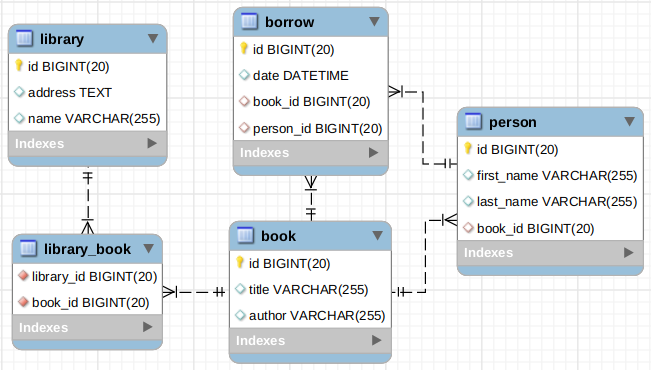

# CHECKPOINT 3

You will have 4 hours to finish this checkpoint. This checkpoint is not an exam, it will allow us to validate your skills, so try to do it as much as possible on your side. If you can't do everything, it doesn't matter, do your best;)


**Tip:**

* don't get stuck, move on to the next question, or ask your instructor *
* there is a time limit, but you can continue working on it later if you want to go back ater thinking it through
* finished or not, think about committing everything and pushing

## I. Retrieving and initializing the project

### 1. Local depot

Clone the contents of this repository locally. **Don't Fork!**

Create a `city_lastname_firstname` branch, which will contain your progress. Replace `city_lastname_firstname` with your city, your last name and first name, without accents or spaces, separated by dashes, with the name in uppercase. Example: for **Éloïse Durant**, create a **lyon-eloise-DURANT** branch.

**Work on this branch for the rest of the *checkpoint* !**.

> Tip: add and send your changes locally after each milestone, to avoid losing your work.

## II. Quiz

At the root of your local repository, you will find a `Quiz.java` file. Compile and run it.

Answer the questions, it will generate a `quiz.txt` file.

You can then edit the file manually to correct your answers.

## III. Algorithm

In the root of your local lepository, you will find a `src/main/java/algo` package, where you can work on the following algorithm:

### 1. Pac-Man

With a Pac-Man grid and its level number as input, write an algorithm that returns the maximum score that can be achieved.

To simplify the exercise, a Pac-Man grid can contain one of the following four characters in each box:

* ' ' : an empty box, worth no points.
* '.' : a pac-gum, which is worth 1 point...
* 'o': a super pac-gum, which is worth 10 points.
* 'x': a fruit, which is worth 100 points multiplied by the level number.

Eg:

```
grid: {
    {'o', '.', '.'},
    {' ', 'x', ' '},
    {'.', '.', 'o'}
}
level: 2
```

To calculate the score, you'll need to add up:

* 4 pac-gums (4)
* 2 super pac-gums (20)
* 1 fruit (200, because we're on the second level)

That's a total of 224!

#### To test
```
bash
./tester.sh PacMan
```

### 2. Caesar cipher
       
In cryptography, a Caesar cipher is a simple encryption technique, in which each letter in the text is replaced by a letter some fixed number of positions down the alphabet.

For example, with a right shift of 3, `a` becomes `d`, `b` becomes `e`, and so on until `w` which becomes `z`. Then `x`, `y` and `z` become `a`, `b` and `c`. 

Create a method which encrypts a word (only in lowercase) using a Caesar cipher, where the shift value (which can be positive or negative) is a parameter.

```
word:      shift:   result:
"abcd"     1        "bcde"
"abcd"     -1       "zabc"
"tacos"    3        "wdfrv"
"zebra"    2        "bgdtc"
```

#### To test

```
bash
./tester.sh Cipher
```

## IV. Spring Boot

#### 1. Modeling

A librarian friend of your instructor requires a website that would allow her to search books and members of the library. After some discussion, you have made the following model together:



* a library (`library`) is characterised by its name (`name`) and its address (`address`)
* a book is characterised by its title (`title`) and its author (`author`).
* a library can propose several books and the same book can be proposed by several libraries
* a member (`person`) is characterised by a first name (`first_name`), a last name (`last_name`) and has a favorite book (`book_id`)
* a participant may borrow ("borrow") one or more books on a given date ("date").

In order to quickly create a prototype, your mission is to create the database from this model using `Spring Data JPA`.

#### 2. Forms

You already have forms to display a list of all the books. You also have a form to create/edit a book.

However, you don't have a controller or the necessary routes to use these forms:

* create a `BookController`
* create a `/book` route that displays the form for creating a book: `book.html`.
* create a `/save` route that allows you to add a new book to the database.
* modify the `book.html` template to handle adding a book to the database
* create a `/books` route that displays the list of books: `books.html`
* modify the `books.html` template to display all books in the database.

#### 3. Search

The last step of the prototype is to create a search form.

In `BookController`:
* create a `/search` route to display the search form: `search.html`.

Then create the following two routes:

* `/search-title`: returns a HTML document (using a new template) displaying a single book, where the title is sent via the form.
* `/search-author`: returns a HTML document (using a new template) displaying a list of books, when the author is sent via the form.

These two routes will have to use methods previously added to the *repository*.

## V. Finalisation

Send the changes to your local branch and push those changes to the remote repository.

In GitHub, make sure the branch exists and that your changes are all there.

Once you've completed it, go back to Odyssey and share the GitHub branch link as your solution.
